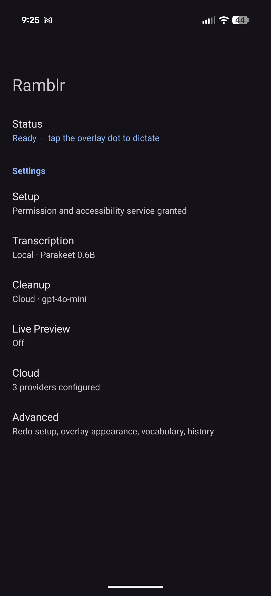
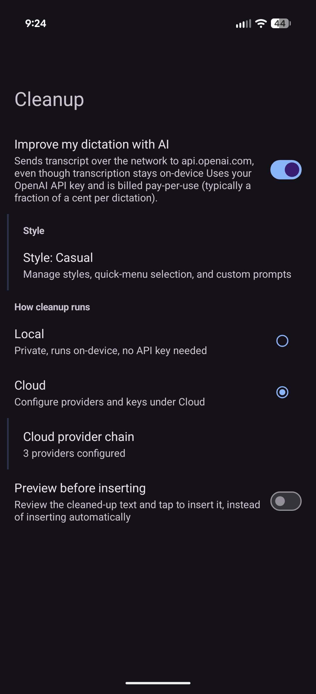
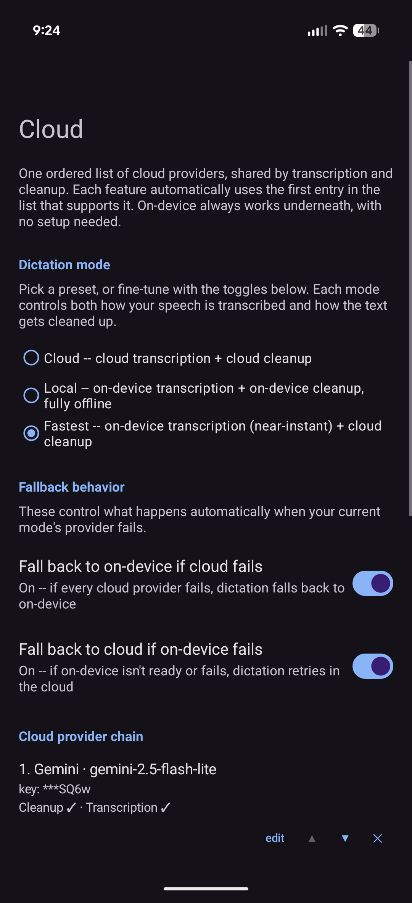
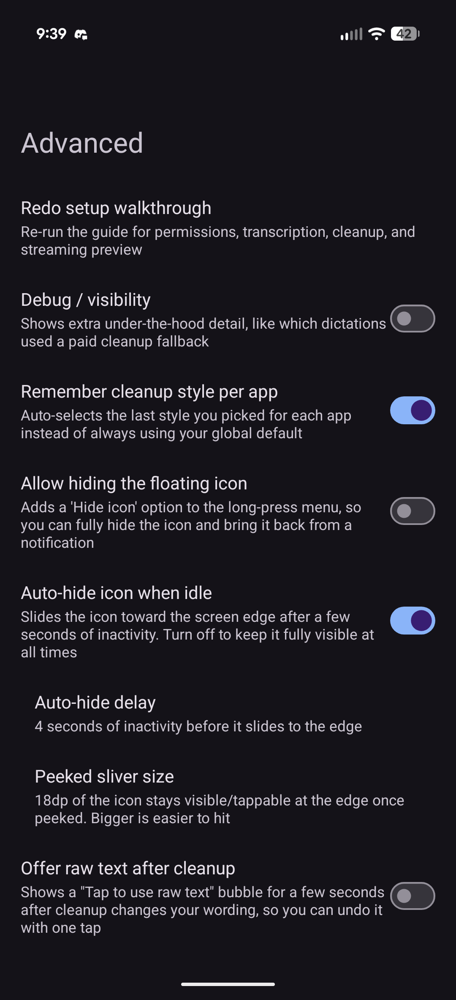

<p align="center">
  
</p>

# Ramblr

**Speak it. Tap once, ramble, tap again — clean text lands wherever your cursor is.**

No keyboard swap, no separate app to paste out of. Ramblr floats a single button over
whatever you're already doing — Slack, Discord, a code editor, an email — and inserts your
words directly into the focused field the moment you're done talking.

- **Tap, ramble, tap.** One button, everywhere. No mode switching, no separate transcript to
  copy-paste.
- **Fully offline if you want it.** On-device transcription and on-device cleanup — nothing
  ever has to touch the network.
- **Or route it through the best cloud models.** OpenAI, Anthropic, and Gemini for cleanup,
  OpenAI Whisper for transcription — chained in whatever fallback order you configure, your own
  API keys, no relay server in between.
- **Fastest of both worlds.** Instant on-device transcription, cloud-grade cleanup — dictation
  feels instant and still reads like you actually meant to write it.
- **Cleanup styles that match how you actually talk.** Formal, Casual, Notes & lists, Email,
  Concise — or write your own. Ramblr strips the "ums," collapses your self-corrections, and
  keeps your meaning, not just your words.
- **It learns your vocabulary.** Feed it your project names and jargon once; cleanup stops
  mangling them forever.

## Screenshots

<p align="center">
  
  
  
  
</p>

## Install

### Easiest: download the APK

Grab the latest APK from [GitHub Releases](https://github.com/trevornk/ramblr/releases) — a new
one is built and published automatically on every push to `main` (unsigned debug build, sideload
only).

Open it on your phone, install it, then launch the app once to finish setup.

### Build from source

Requires JDK 17 and the Android SDK.

```bash
git clone --recursive https://github.com/trevornk/ramblr.git && cd ramblr
make build
```

`--recursive` matters: `llama.cpp` is a git submodule the on-device cleanup build depends on. If
you already cloned without it:

```bash
git submodule update --init --recursive
```

The build automatically downloads the sherpa-onnx native libs (`libsherpa-onnx-jni.so`,
`libonnxruntime.so`) it needs for local transcription — no manual step required.

APK output:

```bash
app/build/outputs/apk/debug/Ramblr-<version>-debug.apk
```

If you use ADB:

```bash
make adb-install
```

## How it works

1. A small overlay button floats on screen
2. Tap once to start recording
3. Tap again to stop
4. Audio is transcribed locally or in the cloud
5. Optional cleanup (local or cloud) fixes grammar, punctuation, and phrasing
6. The text is inserted into the focused text field
7. If insertion fails, the text is copied to the clipboard, and the feedback bubble stays up
   longer and stays tappable so a failed insertion is hard to miss

## Setup

### First-time setup

1. Open **Ramblr**
2. Grant the **audio recording** permission
3. Enable the **Accessibility Service**
4. Pick a **Dictation mode** (Settings → Cloud), or leave the defaults and adjust later:
   - **Local** — on-device transcription + on-device cleanup, fully offline
   - **Cloud** — cloud transcription + cloud cleanup
   - **Fastest** — on-device transcription (near-instant) + cloud cleanup (best text quality)
   - Advanced per-feature overrides are available if you want any other combination
5. If you picked Local/Fastest, download a transcription model in Settings → Transcription
6. If you picked Cloud/Fastest, add at least one cloud provider and its API key in
   Settings → Cloud

Once setup is done, the floating button is ready.

## Why does it need Accessibility?

Ramblr uses Android's Accessibility Service for one narrow reason: to insert dictated text into
the currently focused text field across apps.

It does **not** replace your keyboard. It does **not** run background automation. It only acts
after you explicitly tap the overlay button.

## Privacy

Ramblr supports two transcription modes and, independently, two cleanup modes:

- **Local transcription**: audio is processed on-device using a downloaded sherpa-onnx model.
  Audio never leaves the phone.
- **Cloud transcription**: audio is sent directly from your device to OpenAI's transcription API.
- **Local cleanup**: the transcript text is processed on-device against a small downloaded GGUF
  model (llama.cpp). Nothing leaves the phone.
- **Cloud cleanup**: the transcript text is sent from your device to whichever provider(s) you
  configured — OpenAI, Anthropic, Gemini, and/or a custom OpenAI-compatible endpoint you point it
  at yourself (e.g. a self-hosted router on your own LAN, via **Settings → Cloud → base URL
  override**).

Combine local transcription with local cleanup and nothing ever leaves the device.

I don't run a backend for this app. In every cloud mode, requests go straight from your phone to
the provider using your own API key — there is no relay server in the middle.

Full policy: [PRIVACY.md](PRIVACY.md)

## Cloud providers & the cleanup waterfall

Cleanup isn't limited to a single provider. **Settings → Cloud** lets you build an ordered chain
of steps — e.g. "try Gemini Flash first, fall back to OpenAI, fall back to Anthropic, fall back
to on-device" — and Ramblr walks it in order on any failure (timeout, non-2xx, network error). If
every step fails, the raw (uncleaned) transcript is used, never silently dropped.

Supported chain entries today:

| Provider | Transcription | Cleanup |
|---|---|---|
| OpenAI | ✅ (Whisper) | ✅ |
| Gemini | ✅ | ✅ |
| Anthropic | — | ✅ (no audio input capability) |
| Local (on-device) | ✅ | ✅ |
| Self-hosted OpenAI-compatible gateway | — | ✅ (opt-in, see below) |

### Optional: your own self-hosted gateway

Ramblr can also route cleanup through a self-hosted OpenAI-compatible gateway (e.g. a personal
LLM router). This is entirely opt-in and off by default — there is no bundled/default endpoint in
this repo. To enable it for your own build:

```properties
# local.properties (never committed — see .gitignore)
OMNIROUTE_BASE_URL=https://your-gateway.example/v1
```

Leave it unset and the option simply doesn't appear in the "Add provider" picker; nothing else
about the app changes. See `app/src/main/kotlin/com/trevornk/ramblr/OmniRoute.kt`.

## Local models

Models are downloaded on demand and stored in app-private storage under:

```
/data/data/com.trevornk.ramblr/files/models/
```

Current transcription catalog:

| Model | Size | Notes |
|---|---:|---|
| Parakeet 110M | 100 MB | Best value · smallest, recommended default |
| Canary 180M Flash | 147 MB | Multilingual (en/es/de/fr), punctuated |
| Parakeet 0.6B | 465 MB | Best quality, slower |

A separate small streaming model powers the live preview overlay, and a small GGUF model (LFM2.5
350M by default) powers fully on-device cleanup. The app downloads and extracts all of these
directly from their upstream release archives/Hugging Face — nothing is bundled into the APK, and
downloads are checksum-verified before use.

## Cleanup styles

When cleanup is enabled, the raw transcript is sent through an LLM with a system prompt before
being inserted. **Settings → Cleanup → Style** manages which prompt is used:

| Built-in style | Behavior |
|---|---|
| **Formal** (default) | Fixes spelling, grammar, and punctuation, corrects known project/technical names, and preserves the original sentence structure 1:1. Best for coding, CLI commands, and short technical notes. |
| **Casual** | Minimal edit: punctuation, capitalization, and obvious speech-to-text errors only. |
| **Notes & lists** | Strips filler words and false starts ("um", "like", "you know"), collapses self-corrections ("wait no, actually...") down to the final intended meaning, and reorganizes rambling monologue into paragraphs or lists when you're clearly enumerating items or steps. Short one-line notes are left as a single sentence rather than restructured. |
| **Email** | Rewrites the transcript as a polished, professional email body. Won't invent a greeting or sign-off you didn't actually say. |
| **Concise** | Tightens rambling into the shortest version that still preserves every fact and the original meaning. |

Beyond the five built-ins, the Style manager lets you:

- **Create custom styles** — your own name, subtitle, and prompt, editable and deletable at any
  time
- **Fork a built-in** — editing a built-in style creates a custom copy instead of mutating the
  shipped preset
- **Pick which styles show up in the floating icon's long-press quick menu** (capped at 5–8, so
  it doesn't grow unbounded)
- **Set a per-app style** — e.g. always use Email in Gmail, Notes & lists in a scratchpad app

**Settings → Personal vocabulary** lets you edit the list of project names and jargon (one per
line) that cleanup should recognize instead of mis-hearing, seeded with sensible defaults on
first run. Built-in prompts interpolate this list at send time.

## Development

```bash
make build       # build debug APK
make test        # run unit tests
make adb-install # build + install via ADB
make clean       # clean build artifacts
```

Or directly via Gradle:

```bash
export JAVA_HOME=/path/to/jdk-17
./gradlew testDebugUnitTest
./gradlew assembleDebug
```

### Architecture at a glance

- **`WhisperAccessibilityService.kt`** — the accessibility service: overlay button, recording
  state machine, and the code path that resolves transcription/cleanup candidates and injects
  the result.
- **`ProviderChain.kt` / `ProviderChainRuntime.kt` / `ProviderChainStore.kt`** — the unified,
  user-editable ordered list of providers (OpenAI/Anthropic/Gemini/self-hosted/local) each
  feature (transcription, cleanup) walks looking for its first capable, configured entry.
- **`CleanupWaterfallExecutor.kt`** — executes the cleanup chain: host-grouped fast-fail, no
  retries (this blocks a user waiting on their text), cursor-based last-known-good tracking that
  resets on network change.
- **`PostProcessor.kt`** — the OpenAI-compatible chat-completions client used for cloud cleanup,
  plus the built-in style prompt constants.
- **`CleanupPersona.kt` / `PersonaRegistry.kt` / `CustomPersonaStore.kt` /
  `QuickMenuPersonaStore.kt`** — the Style system: built-in + user-authored cleanup
  personas/prompts, unified lookup, and the persisted quick-menu selection.
- **`ModelDownloader.kt` / `ModelCatalogStore.kt`** — the on-device model catalog (transcription,
  streaming preview, local cleanup), download/extraction, and checksum verification.
- **`LocalTranscriber.kt` / `LlamaCppInference.kt`** — sherpa-onnx (STT) and llama.cpp (cleanup)
  JNI bindings for fully offline operation.
- **`docs/adr/`** — architecture decision records for the bigger design calls (e.g.
  `0001-cleanup-waterfall.md`).

See `AndroidManifest.xml` for the full list of Settings activities
(`SetupActivity`, `TranscriptionActivity`, `CleanupActivity`, `StyleManagerActivity`,
`CloudProviderActivity`, `AdvancedActivity`), one per settings category.

### Prompt eval harness

`PostProcessorTest.kt` only checks JSON parsing, not output *quality*. To compare cleanup
prompts side by side, there's a manual eval harness:

- Sample transcripts live in `app/src/test/resources/eval_samples/` — 23 synthetic but realistic
  dictation samples covering rambling brainstorms, self-corrected sentences, technical jargon,
  spoken lists, quick notes, and two edge cases (a very short two-word command, and a dictation
  that's already clean and needs no restructuring). `eval_samples/NOTES.md` is a human-reference
  companion (not read by the harness) noting what a *good* cleanup output should preserve or fix
  for each sample — use it when judging a report.
- The harness itself is `app/src/test/kotlin/com/trevornk/ramblr/tools/EvalHarness.kt`, a
  standalone `main()` — **not** a JUnit test. It compiles as part of `make test`'s Kotlin
  compilation (so it's checked for compile errors), but JUnit never discovers or runs it, so it
  has no effect on `make test`, `make build`, or CI.

**This tool calls real provider APIs and spends real credits.** Only run it manually, with your
own keys. It runs against every provider whose key is set — OpenAI, Anthropic, and/or Gemini —
skipping (with a stderr warning) any provider whose key env var is unset:

```bash
export OPENAI_API_KEY=sk-...        # never commit this, no .env is read by the tool
export ANTHROPIC_API_KEY=sk-ant-... # optional — omit to skip Anthropic
export GEMINI_API_KEY=AIza...       # optional — omit to skip Gemini
./gradlew runEvalHarness                                              # compares built-in prompts
./gradlew runEvalHarness --args="DEV_PROMPT,SIMPLE_PROMPT,STRUCTURED_PROMPT"   # explicit prompt list
```

Each available provider is run against its own short-list of cheap-tier candidate models (see
the `Provider` enum in `EvalHarness.kt`), overridable per provider:

```bash
OPENAI_EVAL_MODELS=gpt-5.4-nano ./gradlew runEvalHarness       # single OpenAI model instead of the default short-list
ANTHROPIC_EVAL_MODELS=claude-haiku-4-5-20251001 ./gradlew runEvalHarness
GEMINI_EVAL_MODELS=gemini-2.5-flash-lite,gemini-2.5-flash ./gradlew runEvalHarness
./gradlew runEvalHarness --args="DEV_PROMPT eval-reports/dev-only.md"  # custom output path
```

Each run writes a markdown report (default `eval-reports/<prompts>.md`) with the raw transcript
and the cleaned-up output from every provider/model x prompt combination for every sample, for
manual side-by-side review. Review the report yourself before trusting a prompt or model change —
the harness doesn't score or grade output automatically. `eval-reports/` is gitignored so local
runs don't clutter the repo; if you want to share or archive a specific report, `git add -f` it.

To add a new prompt variant to the comparison, add it to the `PROMPT_REGISTRY` map at the top of
`EvalHarness.kt`.

### Tests

```bash
make test
```

Runs the full JVM unit test suite (no emulator/device required) — 700+ tests covering the
provider chain, cleanup waterfall, model catalog, persona system, and dictation state machine.
CI (`.github/workflows/ci.yml`) runs the same suite plus `assembleDebug` on every push and pull
request against `main`.

## App compatibility

Ramblr works best in apps that use standard Android text fields. Some apps use custom text
surfaces or terminal-style views, which may not support direct accessibility paste. When
insertion is not possible, Ramblr falls back to copying the transcript to the clipboard, and the
feedback bubble stays up longer and is tappable to re-copy so a failed insertion is hard to miss.

If the very first scan for an insertable field comes up empty — which can happen for a moment
right after the overlay button is tapped, since the tap itself briefly steals focus — Ramblr
waits ~200ms and scans once more before giving up and falling back to the clipboard. This is a
narrow fix for that specific transient race, not a general compatibility improvement.

There is no compatibility table of tested apps (e.g. Gmail, Slack, Signal, Chrome, Discord, a
Compose-based messaging app, WebView-based inputs) in this README. Building one requires
exercising each app on a real device and recording which strategy succeeds, which hasn't been
done — see [#5](https://github.com/trevornk/ramblr/issues/5) for that as tracked follow-up work.
Don't treat the absence of an app from this doc as either "supported" or "unsupported."

Ramblr intentionally does not implement a full IME (replacement keyboard). It only acts once,
after an explicit tap on the overlay button, and never intercepts normal typing — becoming a
keyboard is a different, much larger feature and is out of scope.

### Termux

Termux's main terminal area is not a standard Android text field, so direct insertion may not
work there.

To use Ramblr in Termux:

1. Focus Termux
2. Swipe the extra keys row (`ESC`, `CTRL`, `ALT`, arrows, etc.) left or right
3. Switch to Termux's native text input box
4. Dictate there

Once text is inserted into the native input box, Termux sends it to the terminal normally.

## Current limitations

- Accessibility permission is required for cross-app insertion
- Some apps may block paste or text injection
- Some apps use custom input surfaces instead of standard Android text fields
- Local transcription/cleanup models are sizable downloads (100–465 MB)
- Cloud modes require your own API key for whichever provider(s) you configure
- Google Play distribution hasn't been evaluated — Accessibility Service apps face real policy
  scrutiny there; see [#99](https://github.com/trevornk/ramblr/issues/99). For now, sideload from
  [Releases](https://github.com/trevornk/ramblr/releases) or build from source.

## Contributing

Issues and PRs are welcome. Before opening a PR:

```bash
export JAVA_HOME=/path/to/jdk-17
./gradlew testDebugUnitTest
./gradlew assembleDebug
```

Please keep diffs focused and add/update tests for any new logic — see existing tests under
`app/src/test/kotlin/com/trevornk/ramblr/` for the project's conventions (small, well-named
`@Test` functions, one behavior per test, pure logic factored out of Android classes wherever
possible so it's unit-testable without Robolectric).

## Attribution

Transcription is powered by [sherpa-onnx](https://github.com/k2-fsa/sherpa-onnx) (Apache-2.0)
and on-device cleanup by [llama.cpp](https://github.com/ggml-org/llama.cpp) (MIT), used as a git
submodule. See [NOTICE](NOTICE) for full third-party attribution.

## License

GPLv3. See [LICENSE](LICENSE) and [NOTICE](NOTICE) (third-party attributions) for details.
