<p align="center">
  
</p>

# Ramblr

**Speak it. Tap once, ramble, tap again — clean text lands wherever your cursor is.**

Ramblr is an Android dictation app that puts a small floating mic on your screen. Tap it in any
app, talk however you actually talk, tap again — and polished text appears in the field you were
already typing in. No keyboard swap, no separate transcript window, no copy-paste.

<p align="center">
  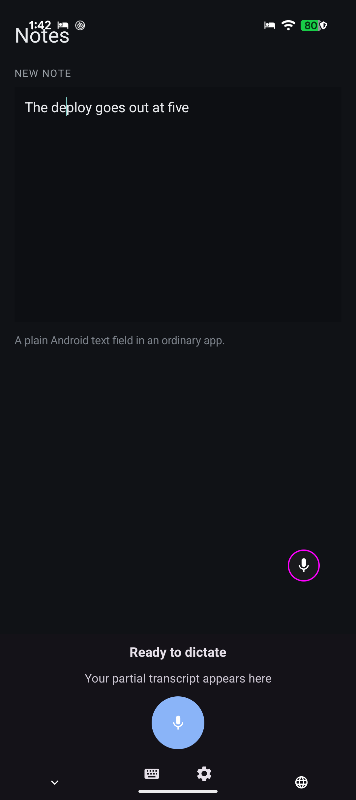
</p>

- **Tap, ramble, tap.** One button, everywhere. No mode switching, no transcript to copy-paste.
- **Fully offline if you want it.** On-device transcription *and* on-device cleanup — nothing ever
  has to touch the network.
- **Or route it through the best cloud models.** OpenAI and Gemini for transcription; OpenAI,
  Anthropic, and Gemini for cleanup — chained in whatever fallback order you configure, with your
  own API keys and no relay server in between.
- **Fastest of both worlds.** Instant on-device transcription plus cloud-grade cleanup, so
  dictation feels immediate and still reads like you meant to write it.
- **Cleanup styles that match how you talk.** Formal, Casual, Notes & lists, Email, Concise — or
  write your own. Ramblr strips the "ums," collapses your self-corrections, and keeps your meaning.
- **It learns your vocabulary.** Feed it your project names and jargon once; cleanup stops mangling
  them. It can even notice the words it keeps fixing and offer to remember them.

---

## Five ways to start dictating

Ramblr isn't just the floating button. Pick whichever fits the moment — most can be active at once.

<p align="center">
  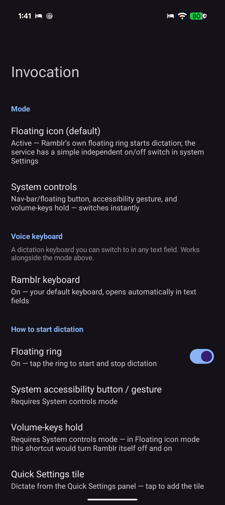
  
  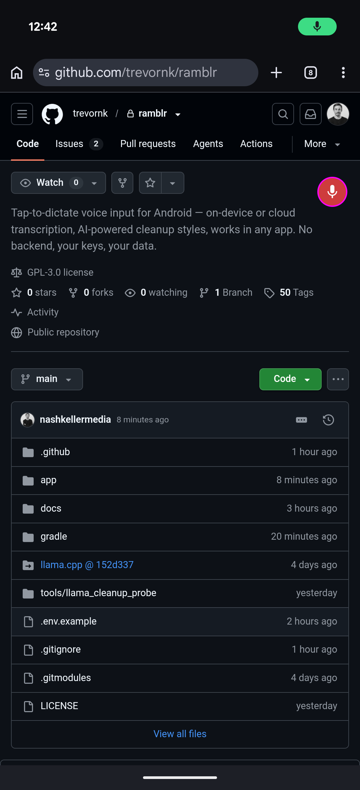
</p>

| # | Method | Needs Accessibility? | Best for |
|---|---|---|---|
| 1 | **Floating icon** (default) | Yes | Everyday use in any app. Tap the ring, talk, tap again. |
| 2 | **Ramblr Voice keyboard** | **No** | Apps where accessibility insertion is blocked, and anywhere you'd rather use a normal IME. |
| 3 | **System controls** (accessibility button / volume-key hold) | Yes | Hands-on-screen triggering without a visible ring. |
| 4 | **Quick Settings tile** | Yes | Starting dictation from the notification shade, ring or no ring. |
| 5 | **Select text → "Ramblr"** | **No** | Cleaning up text that's *already written*, in any app. |

**Settings → Invocation** is where you choose between them.

### 1. Floating icon (default)

A draggable mic ring floats above other apps. Tap to record, tap to stop; the cleaned text is
inserted into whatever field had focus. Long-press does something useful depending on state — cancel
while transcribing, undo a just-inserted result, or open the style quick-menu when idle.

It auto-hides ("peeks") to the screen edge when idle so it isn't in your way, and both the delay and
the look — size, border, fill, glyph color, or a fully custom icon image — are configurable.

### 2. Ramblr Voice keyboard — no Accessibility required

<p align="center">
  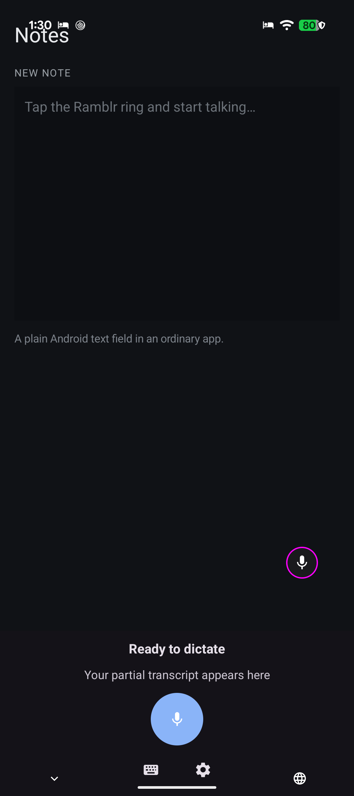
</p>

A voice-only input method: mic, live status, keyboard switcher, settings shortcut. It inserts text
through Android's standard `InputConnection`, so it works **with the accessibility service turned
off entirely**.

It is deliberately **not a full keyboard** — no letter, number, or symbol rows, no swipe typing,
autocorrect, suggestions, clipboard, or emoji UI. Switch back to your usual keyboard to type.
The panel follows your system light/dark theme.

Password, PIN, and web-password fields disable the mic completely. Editors requesting Android's
"no personalized learning" flag still work, but those sessions are excluded from history, quality
logging, and vocabulary suggestions.

### 3. System controls (accessibility button / volume keys)

Instead of an on-screen ring, trigger dictation from Android's own accessibility button/gesture, or
by holding both volume keys.

This mode uses a second service component, and there's a real trade-off worth knowing: turning off
the last bound Ramblr shortcut in system Settings **also disables the service itself** (an Android
`INVISIBLE_TOGGLE` behavior, not a Ramblr bug). Ramblr detects that state and shows a recovery
banner. Volume-key hold is restricted to this mode on purpose — binding it in floating-icon mode
would make your volume keys toggle the *service* instead of dictation.

*Power-user option:* granting `WRITE_SECURE_SETTINGS` via ADB lets Ramblr flip these bindings
in-app instantly and sidestep that trap. It's entirely optional — without it you get a one-tap
deep link into system Settings.

```bash
adb shell pm grant com.trevornk.ramblr android.permission.WRITE_SECURE_SETTINGS
```

### 4. Quick Settings tile

<p align="center">
  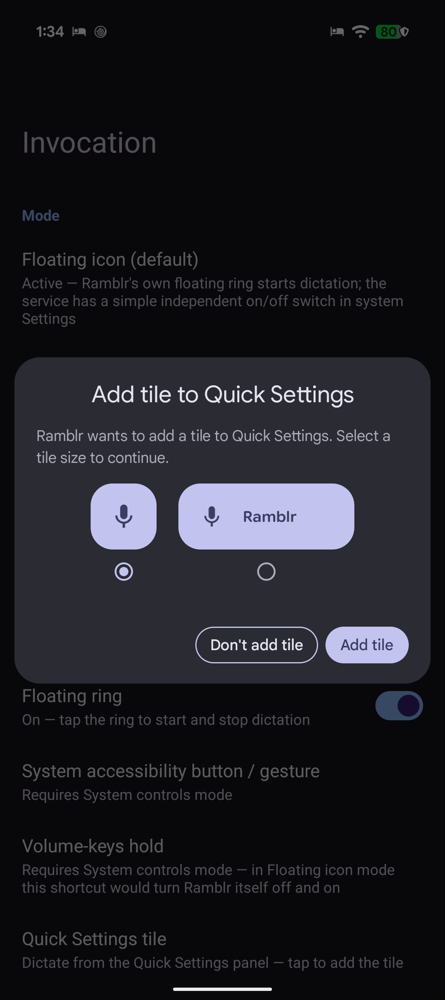
</p>

Swipe down and tap the Ramblr tile to start or stop dictation. On Android 13+ the app asks the
system to add the tile for you; below that you'll get instructions to add it by hand. Android never
tells an app whether its tile was actually placed, so that settings row is a "how to add it" helper,
not a live status readout.

### 5. Select text → "Ramblr" (clean up existing text)

Select text in *any* app, tap **Ramblr** in Android's selection menu, pick a style, and the cleaned
text replaces it (or lands on your clipboard if the field is read-only). Great for tightening a
message you already typed.

This path touches the accessibility service **not at all** — it doesn't need to be enabled, and
Ramblr never reads your screen to make it work.

---

## Getting started

1. **Install** — grab the APK from [Releases](https://github.com/trevornk/ramblr/releases) and
   sideload it, or [build from source](#build-from-source).
2. **Open Ramblr and pick how you want to dictate** — enable the Accessibility service for the
   floating icon, or enable **Ramblr Voice** in Android's keyboard settings if you'd rather not.
3. **Grant microphone permission.** Every mode needs it.
4. **Choose a dictation mode** (Settings → Cloud):
   - **Local** — on-device transcription + on-device cleanup, fully offline
   - **Cloud** — cloud transcription + cloud cleanup
   - **Fastest** — on-device transcription (near-instant) + cloud cleanup (best text quality)
5. **Download a model** (Settings → Transcription) if you chose Local or Fastest, **or add an API
   key** (Settings → Cloud) if you chose Cloud or Fastest.

<p align="center">
  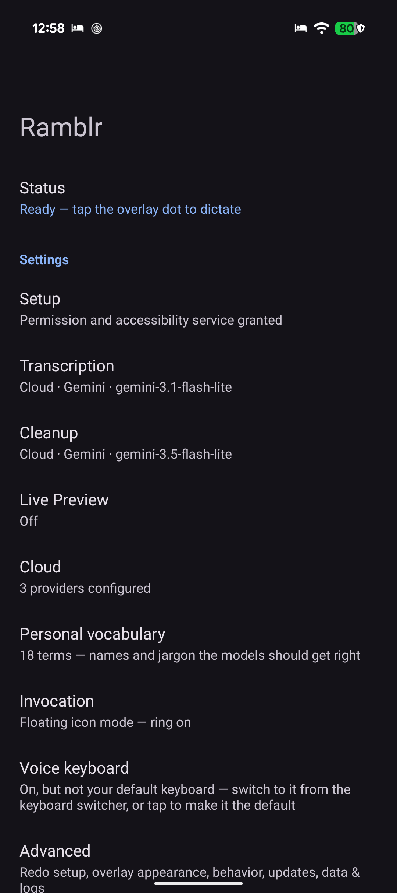
  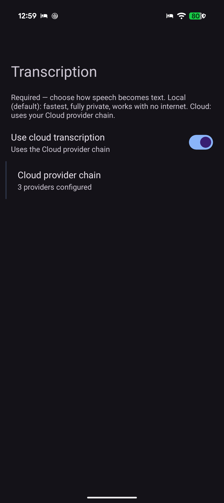
  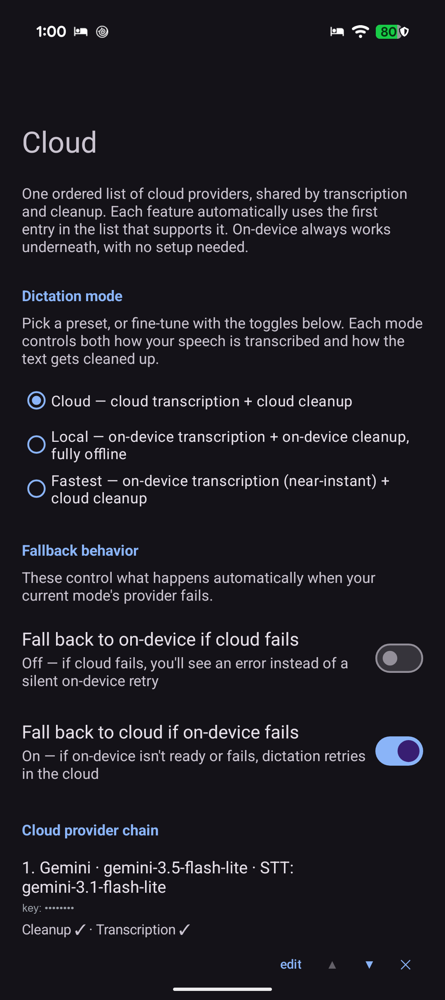
</p>

### How a dictation actually flows

1. You tap the ring (or tile, or keyboard mic) and talk.
2. Audio is transcribed — on-device or in the cloud, your choice.
3. Optional cleanup fixes grammar, punctuation, filler words, and self-corrections.
4. The text is inserted into the focused field.
5. If insertion fails, it's copied to your clipboard and the feedback bubble stays up longer and
   stays tappable, so a failed insert is hard to miss.

---

## Offline or cloud — your call

Transcription and cleanup are chosen **independently**, so "local transcription + cloud cleanup" is
a perfectly normal setup.

| Provider | Transcription | Cleanup | Notes |
|---|:---:|:---:|---|
| **Local (on-device)** | ✅ | ✅ | sherpa-onnx STT + llama.cpp cleanup. No key, no network, always available as the floor under every chain. |
| **OpenAI** | ✅ | ✅ | `gpt-transcribe` / `gpt-4o-transcribe` / `whisper-1` for audio; chat models for cleanup. |
| **Gemini** | ✅ | ✅ | A first-class transcription provider via multimodal audio-in — not cleanup-only. |
| **Anthropic** | — | ✅ | Cleanup only; the API has no audio-input capability. |
| **Self-hosted OpenAI-compatible gateway** | — | ✅ | Opt-in, off by default ([see below](#optional-your-own-self-hosted-gateway)). |

Pair local transcription with local cleanup and **nothing ever leaves the device**. In every cloud
mode, requests go straight from your phone to the provider with your own key — there is no relay
server in the middle. I don't run a backend for this app.

Full policy: [PRIVACY.md](PRIVACY.md)

### The cleanup waterfall

Cleanup isn't one provider. **Settings → Cloud** builds an ordered chain — "try Gemini Flash, fall
back to OpenAI, fall back to Anthropic, fall back to on-device" — and Ramblr walks it on any
timeout, non-2xx, or network error. If every step fails, you get the raw transcript; your words are
never silently dropped.

- Consecutive steps on the **same host fail together** as one unit, instead of retrying a dead host.
- The whole chain is capped at **8 seconds**, tuned from 34 days of field data (p99 3828 ms) so it
  kills no observed real successes.
- Per-step timeouts are clamped to the remaining budget, and the local step gets its own sub-budget
  so a slow on-device attempt can't starve the cloud fallback.

Design rationale: [`docs/adr/0001-cleanup-waterfall.md`](docs/adr/0001-cleanup-waterfall.md).

### Local models

Downloaded on demand, checksum-verified, stored in app-private storage. Nothing is bundled into the
APK.

| Model | Size | Notes |
|---|---:|---|
| Parakeet 0.6B (v3) | 487 MB | **Recommended default** · 2.38% WER · CC-BY-4.0 · 25 languages |
| Parakeet Unified 0.6B | 501 MB | Best quality (1.67% WER) · non-free NVIDIA license, consent-gated |
| Canary 180M Flash | 153 MB | Multilingual (en/es/de/fr), punctuated · 2.44% WER |
| Parakeet 110M | 104 MB | Smallest and fastest · 3.02% WER · occasional garbage tokens |

On-device cleanup uses **Mumble Cleanup 2-Stage** (352 MB, Apache-2.0, a Qwen2.5-0.5B fine-tune
trained specifically for transcript cleanup) by default; LFM2.5 350M (219 MB) is available as an
alternative. A separate 57 MB streaming model powers Live Preview.

---

## Cleanup styles, vocabulary, and per-app behavior

<p align="center">
  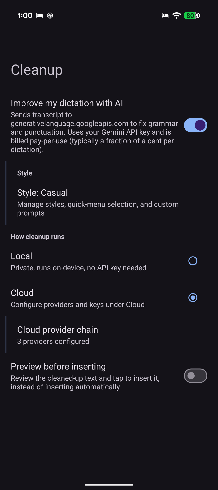
  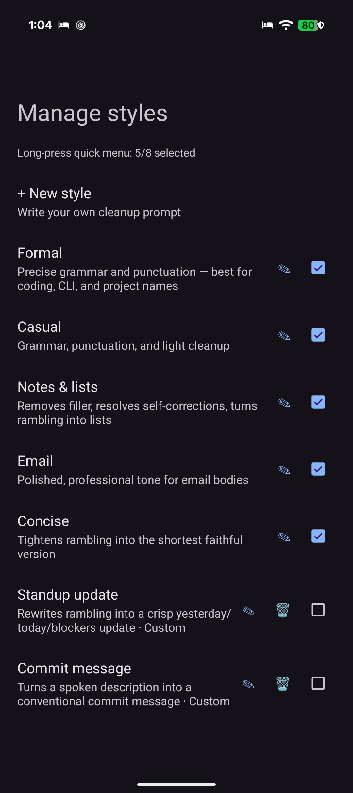
  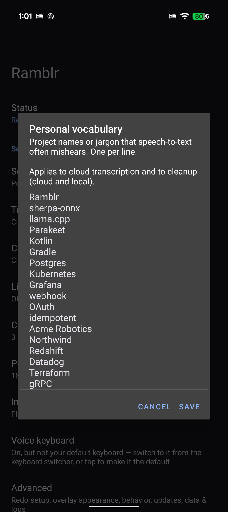
</p>

| Built-in style | Behavior |
|---|---|
| **Formal** (default) | Fixes spelling, grammar, and punctuation, corrects known project/technical names, preserves sentence structure 1:1. Best for coding and short technical notes. |
| **Casual** | Minimal edit: punctuation, capitalization, and obvious speech-to-text errors only. |
| **Notes & lists** | Strips filler and false starts, collapses self-corrections down to your final intended meaning, and reorganizes rambling into paragraphs or lists when you're clearly enumerating. |
| **Email** | Rewrites as a polished email body. Won't invent a greeting or sign-off you didn't say. |
| **Concise** | Tightens rambling into the shortest version that keeps every fact. |

Beyond the five built-ins you can **write custom styles**, **fork a built-in** (editing one creates
a copy rather than mutating the preset), **choose which styles appear in the long-press quick
menu**, and **set a per-app style** — Email in Gmail, Notes & lists in your scratchpad. Ramblr
remembers the style you pick in a given app and reuses it there next time (on by default).

**Personal vocabulary** teaches cleanup your project names and jargon. On the local cleanup path a
deterministic post-pass fixes near-misses ("clawed code" → "Claude Code") — done *after* the model
rather than by prompting it, because interpolating a long term list into a small local model made it
echo the list back as output. Cloud cleanup interpolates the list into the prompt, where that works
fine.

**Smart vocabulary suggestions** (on by default) notice words cleanup keeps correcting, or unusual
names that recur, and offer them as one-tap additions. A term must appear in at least 3 dictations
across 2 different days before it's suggested. Only the candidate word is ever stored — never
transcript text — and turning the feature off erases every accumulated candidate.

---

## Live preview while you speak

<p align="center">
  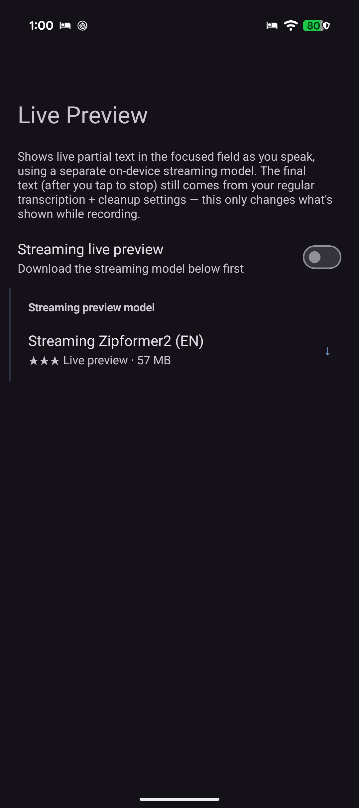
</p>

There are **two different "live" behaviors** in Ramblr, and they are not the same thing:

**Local streaming preview** (Settings → Live Preview, off by default) shows partial text updating as
you talk, using a small on-device streaming model. It works with the **floating icon / accessibility
mode** as well as the keyboard. The final inserted text still comes from the regular transcription
pipeline — streaming only changes what you *see* while speaking. It's always local, never cloud. If
"Preview before inject" is on, partials render in the floating bubble instead of your real field.

**Gemini Cloud Live** (Settings → Cloud, off by default) is an **experimental** cloud streaming
path. It costs roughly 1.8× the batch price, hasn't completed real-device validation, and is
currently wired into the **Ramblr Voice keyboard only** — the floating-icon route does not render
cloud interim text and falls back to normal batch behavior. Tracked in
[#233](https://github.com/trevornk/ramblr/issues/233) and
[#245](https://github.com/trevornk/ramblr/issues/245).

---

## Everything else you can tune

<p align="center">
  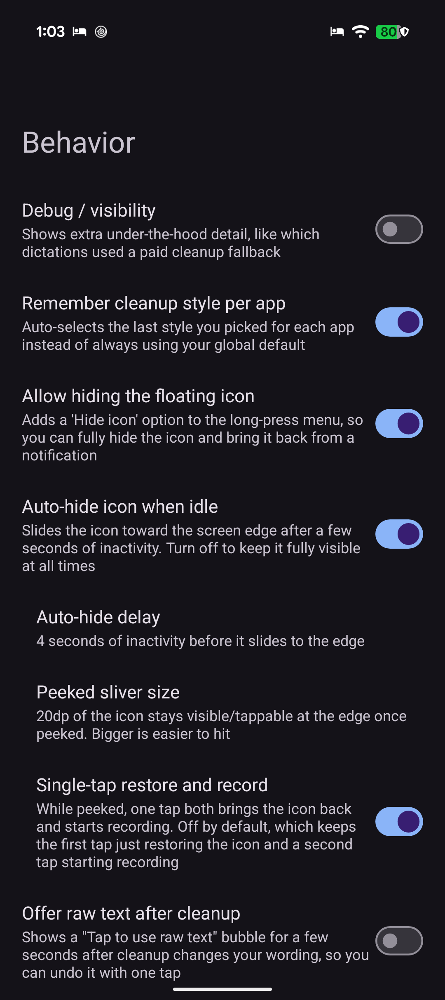
  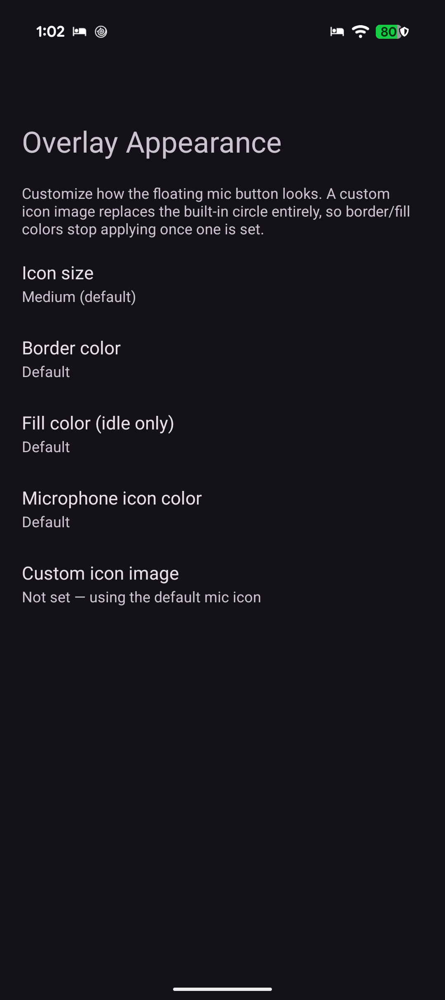
  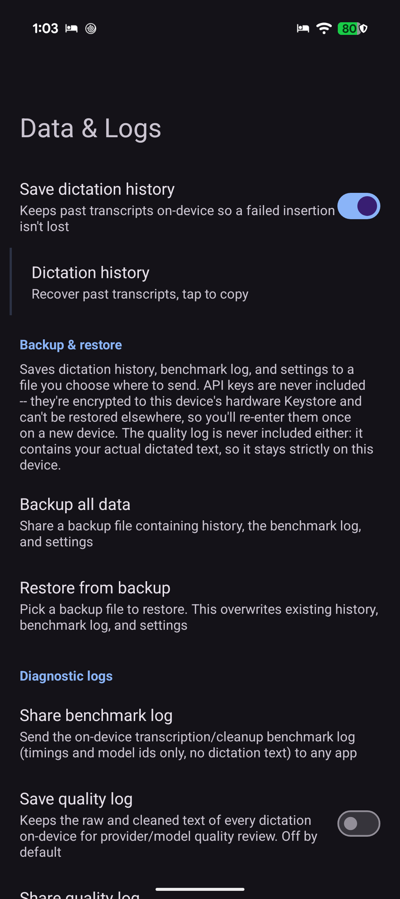
</p>

**Behavior** — auto-stop after silence (off by default, on-device VAD, 2.0 s threshold);
auto-hide/peek delay; single-tap restore-and-record; the "tap to use raw text" undo bubble (on by
default); preview-before-inject; per-app style memory; compressed audio uploads for cloud
transcription (off by default — quality impact hasn't been measured yet, so it's opt-in).

**Overlay appearance** — ring size (44/56/76 dp or custom), border, idle fill, glyph color with an
opacity slider, or a fully custom icon image. Recording and transcribing colors stay fixed because
they convey real state.

**Data & logs** — your last 50 dictations are kept locally so a failed insertion is recoverable
(on by default, tap to copy, long-press to delete). A benchmark log records timings and model IDs
but **never transcript text**. A separate quality log *does* store your actual words for A/B
review, so it's **off by default** and excluded from backups. Manual backup/restore exports history,
benchmark log, and settings as a zip — API keys are deliberately excluded because their encryption
is bound to the device keystore and couldn't be decrypted elsewhere anyway.

Numbers spoken aloud get normalized on the local cleanup path ("four thirty" → "4:30"), and it
stays conservative on purpose — ambiguous quantifiers like "half" or "a dozen" are left alone.

---

## Compatibility and limits

Ramblr works best in apps using standard Android text fields. Some apps use custom or terminal-style
surfaces where direct insertion doesn't work; there, Ramblr falls back to the clipboard and keeps
the bubble up and tappable.

- The floating icon needs Accessibility permission. **The Ramblr Voice keyboard and the
  select-text integration don't.**
- Some apps block paste or text injection outright.
- Local models are sizable downloads (57–501 MB).
- Cloud modes require your own API key.
- Ramblr Voice is not a replacement keyboard — no letters, numbers, symbols, swipe, or emoji.
- Recording is capped at 10 minutes; clips under 300 ms are discarded rather than uploaded.
- Google Play distribution hasn't been evaluated — Accessibility apps face real policy scrutiny
  there; see [#99](https://github.com/trevornk/ramblr/issues/99). Sideload or build from source.

There's no table of tested apps here, because building one honestly means exercising each app on a
real device — tracked in [#5](https://github.com/trevornk/ramblr/issues/5). Don't read a missing app
as either supported or unsupported.

**Requires Android 11 (API 30) or newer.**

### Termux

Termux's terminal area isn't a standard text field. Swipe the extra-keys row (`ESC`, `CTRL`, arrows)
left or right to reach Termux's native input box, dictate there, and Termux forwards it to the
terminal normally.

### Why does it need Accessibility?

For exactly one thing: inserting dictated text into the focused field across apps. Ramblr's
`onAccessibilityEvent` handler is empty — it does not read your screen, and it does not run
background automation. It acts only when you tap its mic. The keyboard and select-text paths don't
use the service at all.

---

## Build from source

Requires JDK 17 and the Android SDK.

```bash
git clone --recursive https://github.com/trevornk/ramblr.git && cd ramblr
make build
```

`--recursive` matters — `llama.cpp` is a submodule the on-device cleanup build needs. If you already
cloned without it: `git submodule update --init --recursive`. The sherpa-onnx native libs download
automatically.

```bash
make build        # debug APK -> app/build/outputs/apk/github/debug/
make test         # JVM unit tests, no device needed
make adb-install  # build + install over ADB
make clean
```

### Distribution flavors

- **`github`** (default) — the sideload build on
  [Releases](https://github.com/trevornk/ramblr/releases). The only flavor with self-update.
- **`storefront`** — for Google Play / F-Droid. Self-update code is **physically absent** from the
  compiled classes, not runtime-disabled: `make build FLAVOR=storefront`.

That split exists because Play's policy forbids an app updating itself outside Play's own mechanism,
and F-Droid assumes the client controls updates. Keeping self-update in its own source set means it
can't violate that policy in a storefront build at all.

### Self-update (github flavor only)

Checks Releases every 6 h. **Notifies** by default; can **optionally auto-install** (off by default)
after verifying the release asset's SHA-256, gated on quiet hours (default 1–5 am) and the service
being genuinely idle — checked twice, ~30 s apart, so an install can't land mid-dictation.

Real releases must include a `versionCode: <int>` line in the notes, since GitHub Releases don't
carry an Android versionCode natively.

### Architecture at a glance

- **`DictationRuntime.kt`** — shared recording/transcription/cleanup state machine used by both
  dictation surfaces.
- **`WhisperAccessibilityService.kt`** — floating overlay + accessibility-backed insertion.
  `SystemControlsAccessibilityService` is an empty subclass of it; the two exist only because
  `flagRequestAccessibilityButton` is static-XML-only and can't be toggled at runtime.
- **`RamblrImeService.kt`** — the voice-only IME, committing via `InputConnection`.
- **`ProcessTextActivity.kt`** — the select-text-in-any-app cleanup path.
- **`ProviderChain.kt` / `ProviderChainRuntime.kt` / `ProviderChainStore.kt`** — the ordered
  provider list each feature walks for its first capable, configured entry.
- **`CleanupWaterfallExecutor.kt`** — host-grouped fast-fail chain execution with deadline clamping.
- **`PostProcessor.kt`** — OpenAI-compatible chat-completions client + built-in style prompts.
- **`CleanupPersona.kt` / `PersonaRegistry.kt` / `CustomPersonaStore.kt` / `QuickMenuPersonaStore.kt`**
  — the Style system.
- **`ModelDownloader.kt` / `ModelCatalogStore.kt`** — model catalog, download, checksum verification.
- **`LocalTranscriber.kt` / `LlamaCppInference.kt`** — sherpa-onnx and llama.cpp JNI bindings.
- **`docs/adr/`** — architecture decision records.

See `AndroidManifest.xml` for all Settings activities.

### Tests

```bash
make test
```

Runs the full JVM unit test suite — no emulator or device required — covering the provider chain,
cleanup waterfall, model catalog, persona system, and dictation state machine. As of this commit
that's **1,751 tests across 166 test classes**, all passing. CI (`.github/workflows/ci.yml`) runs
the same suite plus `assembleDebug` on every push and PR against `main`.

### Prompt eval harness

`PostProcessorTest.kt` checks JSON parsing, not output *quality*. To compare cleanup prompts
side by side there's a manual harness at
`app/src/test/kotlin/com/trevornk/ramblr/tools/EvalHarness.kt` — a standalone `main()`, not a JUnit
test. It compiles during `make test` but is never run by it.

Samples live in `app/src/test/resources/eval_samples/` (23 synthetic dictation samples plus a
human-reference `NOTES.md`).

**It calls real provider APIs and spends real credits.** Run it manually with your own keys:

```bash
export OPENAI_API_KEY=sk-...        # never commit this; no .env is read
export ANTHROPIC_API_KEY=sk-ant-... # optional — omit to skip
export GEMINI_API_KEY=AIza...       # optional — omit to skip
./gradlew runEvalHarness
./gradlew runEvalHarness --args="DEV_PROMPT,SIMPLE_PROMPT,STRUCTURED_PROMPT"
```

Per-provider model lists are overridable (`OPENAI_EVAL_MODELS`, `ANTHROPIC_EVAL_MODELS`,
`GEMINI_EVAL_MODELS`). Each run writes a markdown report to the gitignored `eval-reports/` for
manual side-by-side review — the harness does not score output automatically. Add new variants to
`PROMPT_REGISTRY` in `EvalHarness.kt`.

### Transcription benchmark

A separate manual benchmark measures the *transcription* stage — how accurately Gemini turns audio
into text — via `app/src/test/kotlin/com/trevornk/ramblr/tools/GeminiTranscriptionBenchmark.kt`
(also a standalone `main()`). Scoring, manifest validation, and WAV→PCM conversion
(`TranscriptionMetrics.kt`, `TranscriptionEvalManifest.kt`, `WavPcm.kt`) *are* covered by real unit
tests that run in CI.

The fixture corpus `app/src/test/resources/transcription_eval/` **ships empty** — read its
`README.md` before adding fixtures.

⚠️ **Cost:** calls the real Gemini API once per fixture × target × repetition. Cost is deliberately
not estimated, since the client contracts don't expose usage metadata.

⚠️ **Privacy:** this **uploads audio to Google**. Recorded speech is biometric data — never commit
it here, and never benchmark a recording you lack consent to use. Prefer synthetic TTS fixtures.

```bash
export GEMINI_API_KEY=AIza...
./gradlew runGeminiTranscriptionBenchmark
GEMINI_TRANSCRIPTION_ENGINES=generateContent,interactions ./gradlew runGeminiTranscriptionBenchmark
GEMINI_TRANSCRIPTION_DELAY_MS=7500 ./gradlew runGeminiTranscriptionBenchmark  # pace under quota
GEMINI_TRANSCRIPTION_REPETITIONS=3 ./gradlew runGeminiTranscriptionBenchmark  # expose variance
```

`GEMINI_TRANSCRIBE_MODES` accepts `verbatim` and `smart`. Use **verbatim** for raw-ASR A/B results —
`smart` removes fillers and formats prose, so it's reported as a separate axis and must not be
compared as though it were raw ASR.

The benchmark matches production fidelity where it can: it sends the same prompt real dictation
sends (including your default vocabulary, unless `GEMINI_TRANSCRIPTION_VOCABULARY` overrides it) and
applies the same inline-audio size gate. Known divergences: it runs on the JVM from `.wav` fixtures
rather than on-device, doesn't exercise the compressed-upload path, and doesn't report cost. Reports
(Markdown + JSON) land in the gitignored `eval-reports/` with commit SHA, timestamps, WER/CER,
success rates, and latency percentiles. The run refuses to start on a missing key, empty model list,
or invalid fixture rather than quietly substituting a default.

### Optional: your own self-hosted gateway

Ramblr can route cleanup through a self-hosted OpenAI-compatible gateway. Entirely opt-in, with no
bundled endpoint in this repo:

```properties
# local.properties (never committed)
OMNIROUTE_BASE_URL=https://your-gateway.example/v1
```

Leave it unset and the option doesn't appear in the provider picker. See
`app/src/main/kotlin/com/trevornk/ramblr/OmniRoute.kt`.

## Contributing

Issues and PRs welcome. Before opening one:

```bash
export JAVA_HOME=/path/to/jdk-17
./gradlew testGithubDebugUnitTest
./gradlew assembleGithubDebug
```

Keep diffs focused and add or update tests for new logic — see `app/src/test/kotlin/com/trevornk/ramblr/`
for conventions (small, well-named `@Test` functions, one behavior each, pure logic factored out of
Android classes so it's testable without Robolectric).

## Attribution

Transcription by [sherpa-onnx](https://github.com/k2-fsa/sherpa-onnx) (Apache-2.0), on-device
cleanup by [llama.cpp](https://github.com/ggml-org/llama.cpp) (MIT), both used as git submodules.
See [NOTICE](NOTICE) for full third-party attribution.

## License

GPLv3. See [LICENSE](LICENSE) and [NOTICE](NOTICE).
